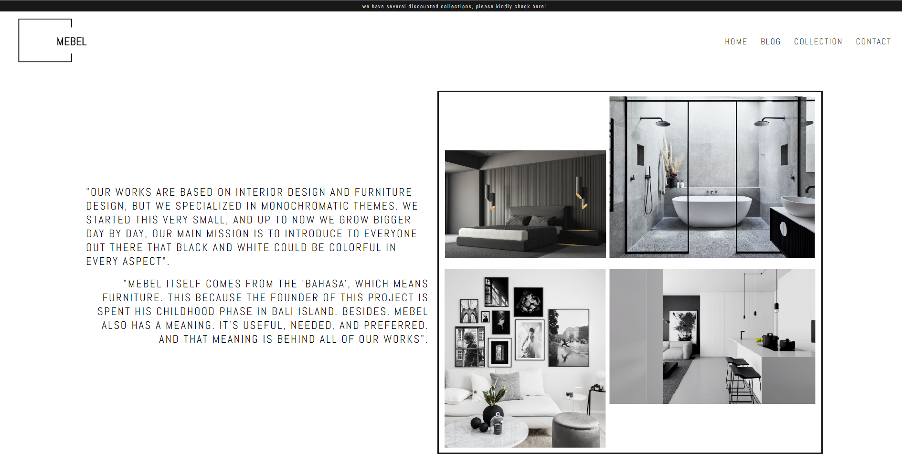

# My Portfolio - Mebel Inc Website

This week's assignment needs to do deployment on Netlify, then set up a custom domain, and the last step is to secure the site with CDN.

## Link to the Website

### <strong>http://mebel-inc.space/</strong>

## First Step

> Deploy the website in Netlify.

### This step flow is basically like doing a deployment as usual to Netflify!

.png>)
.png>)
.png>)
.png>)

## Second Step

> Buy domain on hosting service provider and set up the CDN

This step flow is starting to make an account in the hosting provider, in this case, Niagahoster, then following the procedure, like selecting the domain name then do the payment. After that make an account in CDN, in this case using Cloudflare. Following the step, begin with adding the site, then change the nameserver that provides by Cloudflare, copy-ing to Niagahoster. Then the last one setting up the DNS Records.

.png>)
.png>)
.png>)
.png>)
.png>)
.png>)

## 3rd Step

> Set up custom domain on Netlify page

This is the last step is to set up a custom domain on the Netlify website. Just add a custom domain that is already made in Niagahoster into the section provided by Netlify. Then once it is down, just wait until the website is live.

.png>)

## Let's Connect

- Website: [rioyulinanda](https://riyul.netlify.app)
- LinkedIn: [rioyulinanda](https://id.linkedin.com/in/rio-y-kurniawan-55293172)
- GitHub: [rioyulinanda](https://github.com/rioyulinanda)

## Color and Font References

- #181818 (nero)
- #F5F5F5 (whitesmoke)
- Font: Abel (Google Font)
